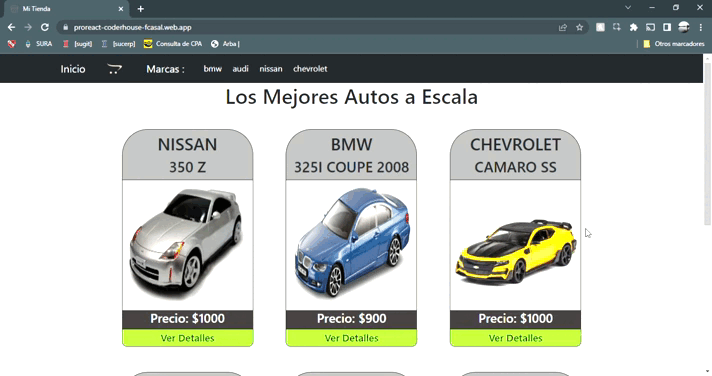

# firebase deployReact E-commerce
### Autor
[Facundo Nahuel Casal](https://github.com/facundocasal)

proyecto final del curso de Reactjs se puede interartuar con el proyecto en el siguiente link https://proreact-coderhouse-fcasal.web.app/

## GIF (pequeña demostracion del sitio )



## librerias utilizadas

- **Boostrap-React** para estilos del sitio, lo use por que me facilita mucho el estar programando los estilos 
- **sweetalert** para los alert en distintas partes del sitio, lo use por que creo que le da toques distintos al sitio
- **firebase** para la base de datos 
- **reacticon** para los iconos del sitio  
- **react-router-dom** para el ruteo del sitio 
- **react-hook-form** para el formulario final creo que es una forma rapida ,  agil y sencilla de implementar un formulario en un proyecto 


### Cómo instanciar el proyecto de manera local
Clonar, ingresar e instalar dependencias
``` bash
git clone https://github.com/facundocasal/ecommerce-react-coderhouse
cd proyecto-coder-react
npm install
```
Iniciar en servidor local
``` bash
npm start
http://localhost:3000
```

### Objetivos principales del proyecto
- **Utilizar una base de datos para obtener los productos**
- **Poder agregar esos productos a un carrito con todos sus elementos**
- **Actualizar la base de datos depues de la compra del usuario**
- **navegar entre  las distintas categorías**
- **Agregar y quitar productos del carrito**
- **Vaciar el carrito**
- **navegacion optimizada en todo el sitio**


## Gracias